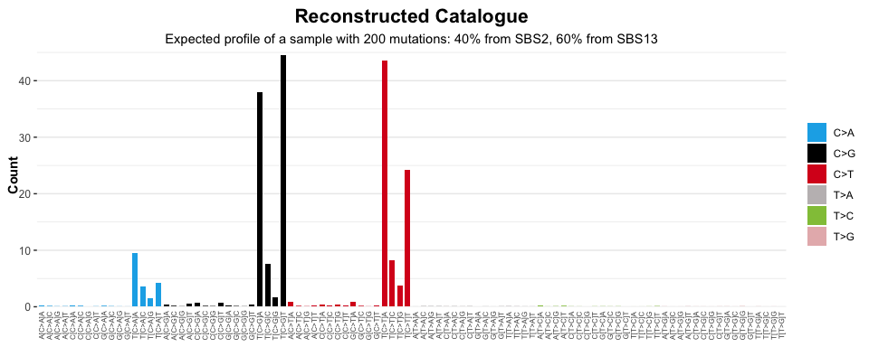

<!-- README.md is generated from README.Rmd. Please edit that file -->


# sigstats

<!-- badges: start -->
[](https://lifecycle.r-lib.org/articles/stages.html#experimental)
[](https://CRAN.R-project.org/package=sigstats)
<!-- badges: end -->

**sigstats** enables common mathematical operations / transformations to be applied to **sigverse** style signatures / catalogues

## Installation

You can install the development version of sigstats like so:

``` r
if (!require("pak", quietly = TRUE))
    install.packages("pak")

pak::pak("selkamand/sigstats")
```

## Quick Start


``` r
library(sigstats)
library(sigstash)
library(sigvis)

# Load a signature collection
signatures <- sig_load("COSMIC_v3.3.1_SBS_GRCh38")

# Create a model that represents a mix of SBS2 (40%) and SBS13 (60%)
model <- c(SBS2 = 0.4, SBS13 = 0.6)

# Add selected signatures to the combined model
combined_signatures <- sig_combine(signatures, model)

# Visualise result
sig_visualise(
  combined_signatures, 
  class = "model",
  title = "Model",
  subtitle = "Created by combining SBS2 (40%) and SBS13 (60%)"
  )
#> ✔ All channels matched perfectly to set [sbs_96]. Using this set for sort order
#> ✔ All types matched perfectly to set [sbs_type]. Using this set for sort order
#> ✔ Types matched perfectly to palette [snv_type]
```


### Reconstruct a mutation catalogue from a signature model

We often need to reconstruct a catalogue (or tally) from our signature model.


``` r
# Load a signature collection
signatures <- sig_load("COSMIC_v3.3.1_SBS_GRCh38")

# Create a model that represents a mix of SBS2 (40%) and SBS13 (60%)
model <- c(SBS2 = 0.4, SBS13 = 0.6)

# Create a new signature by combining SBS2 and SBS13 in ratios dictated by the above model
signature <- sig_combine(signatures, model, format = "signature")

# Reconstruct a perfect catalogue describing what the mutational profile of a sample
# with 200 mutations and the given signature model would look like
reconstuction <- sig_reconstruct(signature, n=200)

# Visualise result
sig_visualise(
  reconstuction, 
  class = "catalogue",
  title = "Reconstructed Catalogue",
  subtitle = "Expected profile of a sample with 200 mutations: 40% from SBS2, 60% from SBS13"
  )
#> ✔ All channels matched perfectly to set [sbs_96]. Using this set for sort order
#> ✔ All types matched perfectly to set [sbs_type]. Using this set for sort order
#> ✔ Types matched perfectly to palette [snv_type]
```



