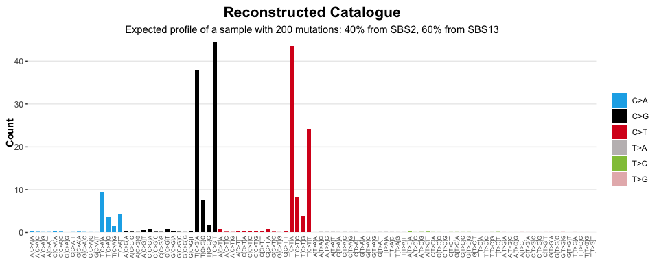

<!-- README.md is generated from README.Rmd. Please edit that file -->

# sigstats

<!-- badges: start -->

[](https://lifecycle.r-lib.org/articles/stages.html#experimental)
[](https://CRAN.R-project.org/package=sigstats)
[](https://github.com/selkamand/sigstats/actions/workflows/R-CMD-check.yaml)
<!-- badges: end -->

**sigstats** enables common mathematical operations / transformations to
be applied to **sigverse** style signatures / catalogues

## Installation

You can install the development version of sigstats like so:

``` r
if (!require("pak", quietly = TRUE))
    install.packages("pak")

pak::pak("selkamand/sigstats")
```

## Quick Start

``` r
library(sigstats)
library(sigstash)
library(sigvis)

# Load a signature collection
signatures <- sig_load("COSMIC_v3.3.1_SBS_GRCh38")

# Create a model that represents a mix of SBS2 (40%) and SBS13 (60%)
model <- c(SBS2 = 0.4, SBS13 = 0.6)

# Add selected signatures to the combined model
combined_signatures <- sig_combine(signatures, model)

# Visualise result
sig_visualise(
  combined_signatures, 
  title = "Model",
  subtitle = "Created by combining SBS2 (40%) and SBS13 (60%)"
  )
#> ✔ All channels matched perfectly to set [sbs_96]. Using this set for sort order
#> ✔ All types matched perfectly to set [sbs_type]. Using this set for sort order
#> ✔ Types matched perfectly to palette [snv_type]
```


### Signature Operations

sigstats helps you add and subtract catalogues/signatures

``` r
# Load a signature collection
signatures <- sig_load("COSMIC_v3.3.1_SBS_GRCh38")

# Reconstruct catalogues for two pure samples (each with 100 mutations)
catalogue1 <- sig_reconstruct(signatures[['SBS3']], n = 100)
catalogue2 <- sig_reconstruct(signatures[['SBS4']], n = 100)

# Subtract catalogue2 from catalogue1
difference <- sig_subtract(catalogue1, catalogue2)#

# Inspect result
head(difference)
#> # A tibble: 6 × 4
#>   type  channel fraction  count
#>   <chr> <chr>      <dbl>  <dbl>
#> 1 C>A   A[C>A]A  0.0224  -2.15 
#> 2 C>A   A[C>A]C  0.0173  -1.66 
#> 3 C>A   A[C>A]G  0.0149  -1.43 
#> 4 C>A   A[C>A]T  0.0181  -1.74 
#> 5 C>G   A[C>G]A  0.0134   1.29 
#> 6 C>G   A[C>G]C  0.00912  0.878
```

### Reconstruct a mutation catalogue from a signature model

We often need to reconstruct a catalogue (or tally) from our signature
model.

``` r
# Load a signature collection
signatures <- sig_load("COSMIC_v3.3.1_SBS_GRCh38")

# Create a model that represents a mix of SBS2 (40%) and SBS13 (60%)
model <- c(SBS2 = 0.4, SBS13 = 0.6)

# Create a new signature by combining SBS2 and SBS13 in ratios dictated by the above model
signature <- sig_combine(signatures, model)

# Reconstruct a perfect catalogue describing what the mutational profile of a sample
# with 200 mutations and the given signature model would look like
reconstuction <- sig_reconstruct(signature, n=200)

# Visualise result
sig_visualise(
  reconstuction, 
  class = "catalogue",
  title = "Reconstructed Catalogue",
  subtitle = "Expected profile of a sample with 200 mutations: 40% from SBS2, 60% from SBS13"
  )
#> ✔ All channels matched perfectly to set [sbs_96]. Using this set for sort order
#> ✔ All types matched perfectly to set [sbs_type]. Using this set for sort order
#> ✔ Types matched perfectly to palette [snv_type]
```


