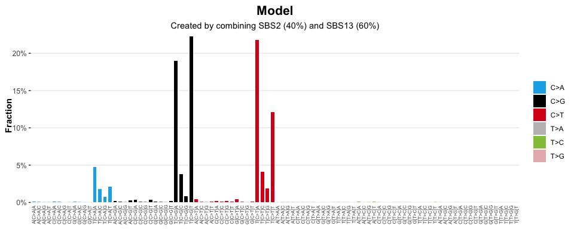

<!-- README.md is generated from README.Rmd. Please edit that file -->

# sigstats

<!-- badges: start -->

[](https://lifecycle.r-lib.org/articles/stages.html#experimental)
[](https://CRAN.R-project.org/package=sigstats)
[](https://github.com/selkamand/sigstats/actions/workflows/R-CMD-check.yaml)
<!-- badges: end -->

**sigstats** enables common mathematical operations / transformations to
be applied to **sigverse** style signatures / catalogues

## Installation

You can install the development version of sigstats like so:

``` r
if (!require("pak", quietly = TRUE))
    install.packages("pak")

pak::pak("selkamand/sigstats")
```

## Quick Start

``` r
library(sigstats)
library(sigstash)
library(sigvis)

# Load a signature collection
signatures <- sig_load("COSMIC_v3.3.1_SBS_GRCh38")

# Create a model that represents a mix of SBS2 (40%) and SBS13 (60%)
model <- c(SBS2 = 0.4, SBS13 = 0.6)

# Add selected signatures to the combined model
combined_signatures <- sig_combine(signatures, model)

# Visualise result
sig_visualise(
  combined_signatures, 
  title = "Model",
  subtitle = "Created by combining SBS2 (40%) and SBS13 (60%)"
  )
#> ✔ All channels matched perfectly to set [sbs_96]. Using this set for sort order
#> ✔ All types matched perfectly to set [sbs_type]. Using this set for sort order
#> ✔ Types matched perfectly to palette [snv_type]
```



### Signature Operations

sigstats helps you add and subtract catalogues/signatures

``` r
# Load a signature collection
signatures <- sig_load("COSMIC_v3.3.1_SBS_GRCh38")

# Reconstruct catalogues for two pure samples (each with 100 mutations)
catalogue1 <- sig_reconstruct(signatures[['SBS3']], n = 100)
catalogue2 <- sig_reconstruct(signatures[['SBS4']], n = 100)
catalogue3 <- sig_reconstruct(signatures[['SBS5']], n = 100)

# Subtract catalogue2 from catalogue1
difference <- catalogue1 %-% catalogue2

# Inspect result
head(difference)
#>     type channel    fraction      count
#> 193  C>A A[C>A]A 0.022382961 -2.1530987
#> 194  C>A A[C>A]C 0.017305082 -1.6646390
#> 195  C>A A[C>A]G 0.014874591 -1.4308412
#> 196  C>A A[C>A]T 0.018086125 -1.7397704
#> 197  C>G A[C>G]A 0.013392234  1.2882479
#> 198  C>G A[C>G]C 0.009122518  0.8775283

# Sum three catalogues
catalogue1 %+% catalogue2 %+% catalogue3
#>     type channel    fraction      count
#> 193  C>A A[C>A]A 0.025140845  7.5422534
#> 194  C>A A[C>A]C 0.019556620  5.8669861
#> 195  C>A A[C>A]G 0.006610550  1.9831650
#> 196  C>A A[C>A]T 0.016187902  4.8563707
#> 197  C>G A[C>G]A 0.012296054  3.6888161
#> 198  C>G A[C>G]C 0.006680065  2.0040195
#> 199  C>G A[C>G]G 0.001119236  0.3357709
#> 200  C>G A[C>G]T 0.010400639  3.1201918
#> 201  C>T A[C>T]A 0.018591614  5.5774841
#> 202  C>T A[C>T]C 0.011376016  3.4128049
#> 203  C>T A[C>T]G 0.003279210  0.9837630
#> 204  C>T A[C>T]T 0.012841364  3.8524091
#> 205  T>A A[T>A]A 0.007402060  2.2206179
#> 206  T>A A[T>A]C 0.005911249  1.7733748
#> 207  T>A A[T>A]G 0.010351356  3.1054067
#> 208  T>A A[T>A]T 0.005490303  1.6470908
#> 209  T>C A[T>C]A 0.023449410  7.0348230
#> 210  T>C A[T>C]C 0.007315471  2.1946412
#> 211  T>C A[T>C]G 0.018425765  5.5277296
#> 212  T>C A[T>C]T 0.018988012  5.6964035
#> 213  T>G A[T>G]A 0.002941629  0.8824886
#> 214  T>G A[T>G]C 0.001792487  0.5377460
#> 215  T>G A[T>G]G 0.005200386  1.5601158
#> 216  T>G A[T>G]T 0.002995597  0.8986790
#> 217  C>A C[C>A]A 0.036674366 11.0023099
#> 218  C>A C[C>A]C 0.036596975 10.9790925
#> 219  C>A C[C>A]G 0.010193282  3.0579845
#> 220  C>A C[C>A]T 0.030131351  9.0394053
#> 221  C>G C[C>G]A 0.011297774  3.3893323
#> 222  C>G C[C>G]C 0.009887456  2.9662367
#> 223  C>G C[C>G]G 0.002471278  0.7413834
#> 224  C>G C[C>G]T 0.012808497  3.8425491
#> 225  C>T C[C>T]A 0.015969598  4.7908794
#> 226  C>T C[C>T]C 0.016685828  5.0057485
#> 227  C>T C[C>T]G 0.007703069  2.3109208
#> 228  C>T C[C>T]T 0.020576421  6.1729262
#> 229  T>A C[T>A]A 0.008624313  2.5872938
#> 230  T>A C[T>A]C 0.011761654  3.5284962
#> 231  T>A C[T>A]G 0.016900186  5.0700558
#> 232  T>A C[T>A]T 0.009659740  2.8979221
#> 233  T>C C[T>C]A 0.009095737  2.7287211
#> 234  T>C C[T>C]C 0.009107742  2.7323227
#> 235  T>C C[T>C]G 0.012121890  3.6365670
#> 236  T>C C[T>C]T 0.011150273  3.3450820
#> 237  T>G C[T>G]A 0.002608360  0.7825080
#> 238  T>G C[T>G]C 0.004039645  1.2118936
#> 239  T>G C[T>G]G 0.006869552  2.0608655
#> 240  T>G C[T>G]T 0.005206204  1.5618613
#> 241  C>A G[C>A]A 0.016338672  4.9016016
#> 242  C>A G[C>A]C 0.017571383  5.2714149
#> 243  C>A G[C>A]G 0.006419293  1.9257880
#> 244  C>A G[C>A]T 0.012631887  3.7895661
#> 245  C>G G[C>G]A 0.007569400  2.2708199
#> 246  C>G G[C>G]C 0.006407871  1.9223614
#> 247  C>G G[C>G]G 0.002433293  0.7299880
#> 248  C>G G[C>G]T 0.008124929  2.4374787
#> 249  C>T G[C>T]A 0.013313488  3.9940464
#> 250  C>T G[C>T]C 0.012987867  3.8963602
#> 251  C>T G[C>T]G 0.004474679  1.3424036
#> 252  C>T G[C>T]T 0.011193117  3.3579350
#> 253  T>A G[T>A]A 0.006609142  1.9827425
#> 254  T>A G[T>A]C 0.004644861  1.3934582
#> 255  T>A G[T>A]G 0.009645684  2.8937051
#> 256  T>A G[T>A]T 0.007112597  2.1337790
#> 257  T>C G[T>C]A 0.008933222  2.6799666
#> 258  T>C G[T>C]C 0.004898068  1.4694205
#> 259  T>C G[T>C]G 0.009459062  2.8377186
#> 260  T>C G[T>C]T 0.008329559  2.4988678
#> 261  T>G G[T>G]A 0.002496523  0.7489569
#> 262  T>G G[T>G]C 0.001428218  0.4284653
#> 263  T>G G[T>G]G 0.006235766  1.8707298
#> 264  T>G G[T>G]T 0.002849820  0.8549461
#> 265  C>A T[C>A]A 0.018798045  5.6394135
#> 266  C>A T[C>A]C 0.024386104  7.3158311
#> 267  C>A T[C>A]G 0.004973720  1.4921161
#> 268  C>A T[C>A]T 0.021536377  6.4609132
#> 269  C>G T[C>G]A 0.008274661  2.4823983
#> 270  C>G T[C>G]C 0.011325426  3.3976278
#> 271  C>G T[C>G]G 0.001381567  0.4144701
#> 272  C>G T[C>G]T 0.013254230  3.9762690
#> 273  C>T T[C>T]A 0.009982055  2.9946166
#> 274  C>T T[C>T]C 0.014477519  4.3432556
#> 275  C>T T[C>T]G 0.005838103  1.7514308
#> 276  C>T T[C>T]T 0.012243639  3.6730918
#> 277  T>A T[T>A]A 0.007142323  2.1426968
#> 278  T>A T[T>A]C 0.006436888  1.9310663
#> 279  T>A T[T>A]G 0.007066453  2.1199359
#> 280  T>A T[T>A]T 0.009156982  2.7470946
#> 281  T>C T[T>C]A 0.011716363  3.5149088
#> 282  T>C T[T>C]C 0.006519940  1.9559820
#> 283  T>C T[T>C]G 0.007173081  2.1519242
#> 284  T>C T[T>C]T 0.011048486  3.3145458
#> 285  T>G T[T>G]A 0.004227468  1.2682404
#> 286  T>G T[T>G]C 0.004418606  1.3255818
#> 287  T>G T[T>G]G 0.005811939  1.7435818
#> 288  T>G T[T>G]T 0.008216595  2.4649784

# Sum a catalogue collection
catalogues <- list(cat1 = catalogue1, cat2 = catalogue2, cat3 = catalogue3)
sig_sum(catalogues)
#>     type channel    fraction      count
#> 193  C>A A[C>A]A 0.025140845  7.5422534
#> 194  C>A A[C>A]C 0.019556620  5.8669861
#> 195  C>A A[C>A]G 0.006610550  1.9831650
#> 196  C>A A[C>A]T 0.016187902  4.8563707
#> 197  C>G A[C>G]A 0.012296054  3.6888161
#> 198  C>G A[C>G]C 0.006680065  2.0040195
#> 199  C>G A[C>G]G 0.001119236  0.3357709
#> 200  C>G A[C>G]T 0.010400639  3.1201918
#> 201  C>T A[C>T]A 0.018591614  5.5774841
#> 202  C>T A[C>T]C 0.011376016  3.4128049
#> 203  C>T A[C>T]G 0.003279210  0.9837630
#> 204  C>T A[C>T]T 0.012841364  3.8524091
#> 205  T>A A[T>A]A 0.007402060  2.2206179
#> 206  T>A A[T>A]C 0.005911249  1.7733748
#> 207  T>A A[T>A]G 0.010351356  3.1054067
#> 208  T>A A[T>A]T 0.005490303  1.6470908
#> 209  T>C A[T>C]A 0.023449410  7.0348230
#> 210  T>C A[T>C]C 0.007315471  2.1946412
#> 211  T>C A[T>C]G 0.018425765  5.5277296
#> 212  T>C A[T>C]T 0.018988012  5.6964035
#> 213  T>G A[T>G]A 0.002941629  0.8824886
#> 214  T>G A[T>G]C 0.001792487  0.5377460
#> 215  T>G A[T>G]G 0.005200386  1.5601158
#> 216  T>G A[T>G]T 0.002995597  0.8986790
#> 217  C>A C[C>A]A 0.036674366 11.0023099
#> 218  C>A C[C>A]C 0.036596975 10.9790925
#> 219  C>A C[C>A]G 0.010193282  3.0579845
#> 220  C>A C[C>A]T 0.030131351  9.0394053
#> 221  C>G C[C>G]A 0.011297774  3.3893323
#> 222  C>G C[C>G]C 0.009887456  2.9662367
#> 223  C>G C[C>G]G 0.002471278  0.7413834
#> 224  C>G C[C>G]T 0.012808497  3.8425491
#> 225  C>T C[C>T]A 0.015969598  4.7908794
#> 226  C>T C[C>T]C 0.016685828  5.0057485
#> 227  C>T C[C>T]G 0.007703069  2.3109208
#> 228  C>T C[C>T]T 0.020576421  6.1729262
#> 229  T>A C[T>A]A 0.008624313  2.5872938
#> 230  T>A C[T>A]C 0.011761654  3.5284962
#> 231  T>A C[T>A]G 0.016900186  5.0700558
#> 232  T>A C[T>A]T 0.009659740  2.8979221
#> 233  T>C C[T>C]A 0.009095737  2.7287211
#> 234  T>C C[T>C]C 0.009107742  2.7323227
#> 235  T>C C[T>C]G 0.012121890  3.6365670
#> 236  T>C C[T>C]T 0.011150273  3.3450820
#> 237  T>G C[T>G]A 0.002608360  0.7825080
#> 238  T>G C[T>G]C 0.004039645  1.2118936
#> 239  T>G C[T>G]G 0.006869552  2.0608655
#> 240  T>G C[T>G]T 0.005206204  1.5618613
#> 241  C>A G[C>A]A 0.016338672  4.9016016
#> 242  C>A G[C>A]C 0.017571383  5.2714149
#> 243  C>A G[C>A]G 0.006419293  1.9257880
#> 244  C>A G[C>A]T 0.012631887  3.7895661
#> 245  C>G G[C>G]A 0.007569400  2.2708199
#> 246  C>G G[C>G]C 0.006407871  1.9223614
#> 247  C>G G[C>G]G 0.002433293  0.7299880
#> 248  C>G G[C>G]T 0.008124929  2.4374787
#> 249  C>T G[C>T]A 0.013313488  3.9940464
#> 250  C>T G[C>T]C 0.012987867  3.8963602
#> 251  C>T G[C>T]G 0.004474679  1.3424036
#> 252  C>T G[C>T]T 0.011193117  3.3579350
#> 253  T>A G[T>A]A 0.006609142  1.9827425
#> 254  T>A G[T>A]C 0.004644861  1.3934582
#> 255  T>A G[T>A]G 0.009645684  2.8937051
#> 256  T>A G[T>A]T 0.007112597  2.1337790
#> 257  T>C G[T>C]A 0.008933222  2.6799666
#> 258  T>C G[T>C]C 0.004898068  1.4694205
#> 259  T>C G[T>C]G 0.009459062  2.8377186
#> 260  T>C G[T>C]T 0.008329559  2.4988678
#> 261  T>G G[T>G]A 0.002496523  0.7489569
#> 262  T>G G[T>G]C 0.001428218  0.4284653
#> 263  T>G G[T>G]G 0.006235766  1.8707298
#> 264  T>G G[T>G]T 0.002849820  0.8549461
#> 265  C>A T[C>A]A 0.018798045  5.6394135
#> 266  C>A T[C>A]C 0.024386104  7.3158311
#> 267  C>A T[C>A]G 0.004973720  1.4921161
#> 268  C>A T[C>A]T 0.021536377  6.4609132
#> 269  C>G T[C>G]A 0.008274661  2.4823983
#> 270  C>G T[C>G]C 0.011325426  3.3976278
#> 271  C>G T[C>G]G 0.001381567  0.4144701
#> 272  C>G T[C>G]T 0.013254230  3.9762690
#> 273  C>T T[C>T]A 0.009982055  2.9946166
#> 274  C>T T[C>T]C 0.014477519  4.3432556
#> 275  C>T T[C>T]G 0.005838103  1.7514308
#> 276  C>T T[C>T]T 0.012243639  3.6730918
#> 277  T>A T[T>A]A 0.007142323  2.1426968
#> 278  T>A T[T>A]C 0.006436888  1.9310663
#> 279  T>A T[T>A]G 0.007066453  2.1199359
#> 280  T>A T[T>A]T 0.009156982  2.7470946
#> 281  T>C T[T>C]A 0.011716363  3.5149088
#> 282  T>C T[T>C]C 0.006519940  1.9559820
#> 283  T>C T[T>C]G 0.007173081  2.1519242
#> 284  T>C T[T>C]T 0.011048486  3.3145458
#> 285  T>G T[T>G]A 0.004227468  1.2682404
#> 286  T>G T[T>G]C 0.004418606  1.3255818
#> 287  T>G T[T>G]G 0.005811939  1.7435818
#> 288  T>G T[T>G]T 0.008216595  2.4649784
```

### Reconstruct a mutation catalogue from a signature model

We often need to reconstruct a catalogue (or tally) from our signature
model.

``` r
# Load a signature collection
signatures <- sig_load("COSMIC_v3.3.1_SBS_GRCh38")

# Create a model that represents a mix of SBS2 (40%) and SBS13 (60%)
model <- c(SBS2 = 0.4, SBS13 = 0.6)

# Create a new signature by combining SBS2 and SBS13 in ratios dictated by the above model
signature <- sig_combine(signatures, model)

# Reconstruct a perfect catalogue describing what the mutational profile of a sample
# with 200 mutations and the given signature model would look like
reconstuction <- sig_reconstruct(signature, n=200)

# Visualise result
sig_visualise(
  reconstuction, 
  class = "catalogue",
  title = "Reconstructed Catalogue",
  subtitle = "Expected profile of a sample with 200 mutations: 40% from SBS2, 60% from SBS13"
  )
#> ✔ All channels matched perfectly to set [sbs_96]. Using this set for sort order
#> ✔ All types matched perfectly to set [sbs_type]. Using this set for sort order
#> ✔ Types matched perfectly to palette [snv_type]
```


### Compute Stats on Signature Collections

``` r

# Load a signature collection
signatures <- sig_load("COSMIC_v3.3.1_SBS_GRCh38")

# Compute common statistics:
# e.g. Gini coefficient, Exponentiated Shannon Index, KL divergence, L1/L2/L3 Norms)
stats <- sig_collection_stats(signatures)

# Print Stats
head(stats)
#>     id      gini shannon_index shannon_index_exp kl_divergence_from_uniform
#> 1 SBS1 0.9480089      1.856082          6.398621                  2.7082657
#> 2 SBS2 0.9798792      1.218777          3.383048                  3.3455711
#> 3 SBS3 0.3268209      4.385754         80.298771                  0.1785939
#> 4 SBS4 0.6456680      3.809528         45.129134                  0.7548202
#> 5 SBS5 0.4063016      4.296474         73.440415                  0.2678738
#> 6 SBS6 0.8851745      2.718273         15.154126                  1.8460754
#>      l3_norm   l2_norm l1_norm l0_norm max_channel_fraction
#> 1 0.41142780 0.4844887       1      96           0.37062390
#> 2 0.56614330 0.6231289       1      96           0.53513019
#> 3 0.06042455 0.1174484       1      96           0.02499156
#> 4 0.12333330 0.1852696       1      96           0.08026888
#> 5 0.07475926 0.1306525       1      96           0.04597922
#> 6 0.23115412 0.3114406       1      96           0.17879063
#>   shannon_index_exp_scaled l3_norm_scaled l2_norm_scaled l1_norm_scaled
#> 1               0.06665230   0.0042857062    0.005046757     0.01041667
#> 2               0.03524008   0.0058973261    0.006490926     0.01041667
#> 3               0.83644553   0.0006294224    0.001223421     0.01041667
#> 4               0.47009514   0.0012847218    0.001929892     0.01041667
#> 5               0.76500432   0.0007787423    0.001360964     0.01041667
#> 6               0.15785548   0.0024078554    0.003244173     0.01041667
#>   l0_norm_scaled
#> 1              1
#> 2              1
#> 3              1
#> 4              1
#> 5              1
#> 6              1

# Plot kl_divergence_from_uniform against exponentiated shannon index
plot(
  x = stats[["kl_divergence_from_uniform"]], 
  y = stats[["shannon_index_exp_scaled"]]
)
```

 \###
Compute Similarity/Distance Measures

``` r
signatures <- sig_load("COSMIC_v3.3.1_SBS_GRCh38")

# Pairwise cosine similarity
sim_df <- sig_collection_pairwise_stats(
  signatures,
  metric = "cosine_similarity",
  format = "data.frame"
)
head(sim_df)
#>     S1    S2 cosine_similarity
#> 1 SBS1  SBS2        0.02031489
#> 2 SBS1  SBS3        0.05372626
#> 3 SBS1  SBS4        0.02361321
#> 4 SBS1  SBS5        0.19426687
#> 5 SBS1  SBS6        0.77021158
#> 6 SBS1 SBS7a        0.04804510

# L2 (Euclidean) distance matrix
dist_mat <- sig_collection_pairwise_stats(
  signatures,
  metric = "L2",
  format = "matrix"
)
```

### Model Correctness

Quantify how well a fitted model matches ground truth signature weights.

``` r

signatures <- sig_load("COSMIC_v3.3.1_SBS_GRCh38")
cosmic_signatures <- names(signatures)

observed <- c(SBS1 = 0.7, SBS5 = 0.3, SBS18 = 0)
truth <- c(SBS1 = 0.6, SBS5 = 0.4, SBS18 = 0)

metrics <- sig_model_correctness(observed, truth, all_signatures = cosmic_signatures)

print(metrics)
#> $fitting_error
#> [1] 0.1
#> 
#> $RMSE
#> [1] 0.01591115
#> 
#> $n_false_positives
#> [1] 0
#> 
#> $n_true_positives
#> [1] 2
#> 
#> $n_false_negatives
#> [1] 0
#> 
#> $n_true_negatives
#> [1] 77
#> 
#> $total_false_positive_contributions
#> [1] 0
#> 
#> $precision
#> [1] 1
#> 
#> $recall
#> [1] 1
#> 
#> $specificity
#> [1] 1
#> 
#> $mathews_correlation_coeff
#> [1] 1
#> 
#> $f1
#> [1] 1
#> 
#> $balanced_accuracy
#> [1] 1
```
